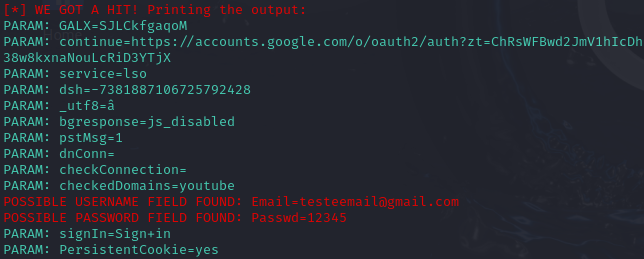

# Phishing para capturas de acesso do gmail

## Ferramentas
- Kali Linux
- Setoolkit

## Configurando o phishing no Kali Linux

- Acesso ao root: `sudo su`
- Inicializando o setoolkit: `setoolkit`
- Tipo de ataque: `Social-Engineering Attacks`
- Vetor de ataque: `Web Site Attack Vectors`
- Método de Ataque: `Credential Harvester Attack Method`
- Método de Ataque: `Web Templates`
- Escolha de template gmail: `Google`
- Obtendo o endereço da máquina: `ifconfig`

## Resultado

